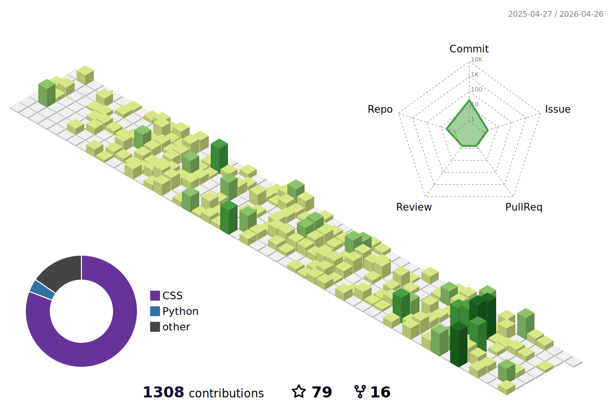

### Hi there is KezhiAdore👋

<!--
**KezhiAdore/KezhiAdore** is a ✨ _special_ ✨ repository because its `README.md` (this file) appears on your GitHub profile.

Here are some ideas to get you started:
-->

- 🔭 I’m currently working on Xi'an Jiaotong University
- 🌱 I’m currently learning Game Theory and Reinforcement Learning
- 📫 How to reach me: yuzhaokz@163.com
- 💻 My blog is on https://www.kezhi.tech

# Blog posts
<!-- BLOG-POST-LIST:START -->
- [电脑软件配置单](https://www.kezhi.tech/f9af8ec4.html)
- [Docker-VNC桌面配置](https://www.kezhi.tech/d97606bd.html)
- [DDPG算法中AC学习率设置对训练效果的影响](https://www.kezhi.tech/46493a5d.html)
- [聚会互认问题小记](https://www.kezhi.tech/244334e3.html)
- [2023毕业快乐](https://www.kezhi.tech/48e66169.html)
<!-- BLOG-POST-LIST:END -->

