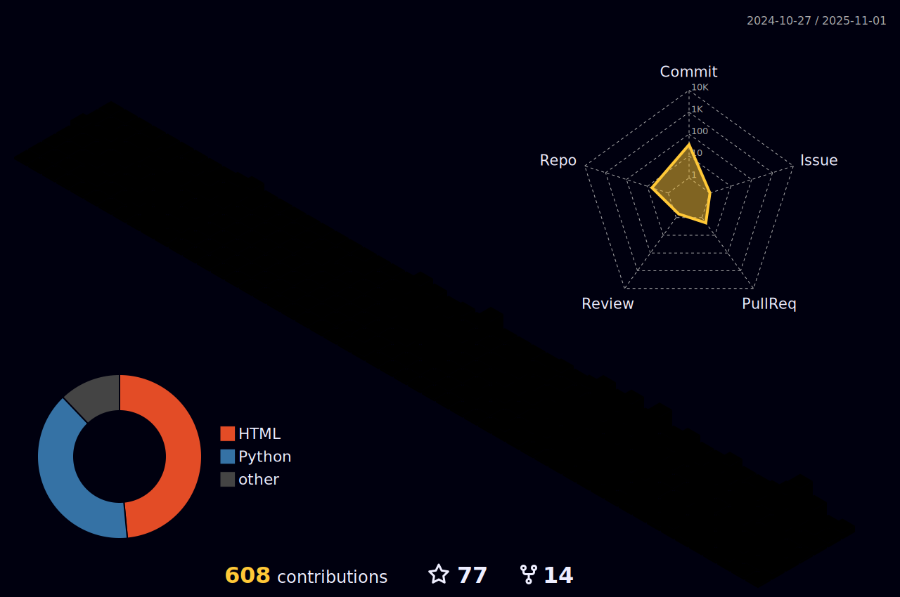

### Hi there is KezhiAdore👋
---

<!--
**KezhiAdore/KezhiAdore** is a ✨ _special_ ✨ repository because its `README.md` (this file) appears on your GitHub profile.

Here are some ideas to get you started:
-->

  

---

  

- 🔭 I’m currently working on Xi'an Jiaotong University
- 🌱 I’m currently learning Game Theory and Reinforcement Learning
- 📫 How to reach me: yuzhaokz@163.com
- 💻 My blog is on https://www.kezhi.tech

---

  
   
  

## Recent Blog Posts
<!-- BLOG-POST-LIST:START -->
- [第一篇论文完成后](https://www.kezhi.tech/437bf60f.html)
- [Policy Optimization](https://www.kezhi.tech/309dbe23.html)
- [Python脚本+企业微信通知实验结果](https://www.kezhi.tech/4d54863.html)
- [高斯分布熵的推导](https://www.kezhi.tech/80e25821.html)
- [电脑软件配置单](https://www.kezhi.tech/f9af8ec4.html)
<!-- BLOG-POST-LIST:END -->

